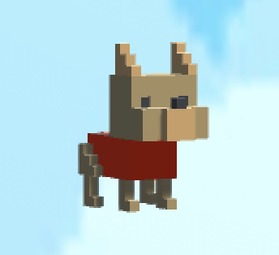

# BoneAppetit
First demo unity project followed from the UOS course "Intro to Unity". First demo unity project followed from the UOS course "Intro to Unity".
BoneAppetit is a 2D game. The game consists of 4 stages varying in difficulty. Our main character to be controlled is a dog called Doggo.

### The Story
Doggo has been trapped by a monster in an imaginary world. In the beginning, everything looks nice and attractive for Doggo. However, suddenly the sky starts raining chocolates which is deadly for him. In addition, his worst enemy "Catto" are there, and only touching them makes him lose one of his lives. 
In order to escape this nightmare and go back to reality, Doggo has to find a bone in each stage. The bone works as a portal, which teleports Doggo to higher stages. Finally in stage 4 Doggo faces his capturer, the monster, where he can shoot him with love, if Doggo shot enough heart bullets on the monster. The monster goes away and Doggo wins and goes back to reality, where he finally can sniff everything again.

