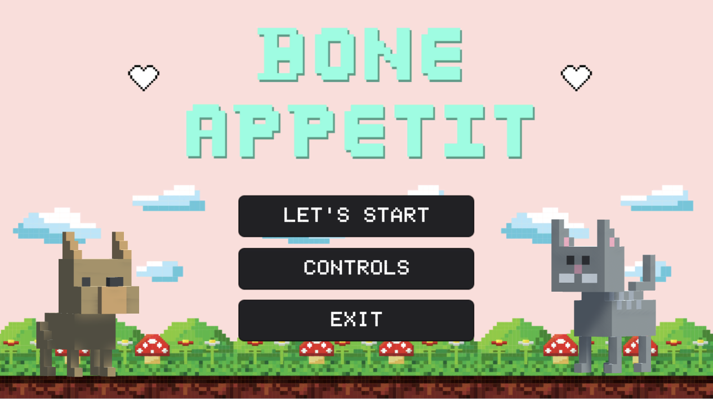
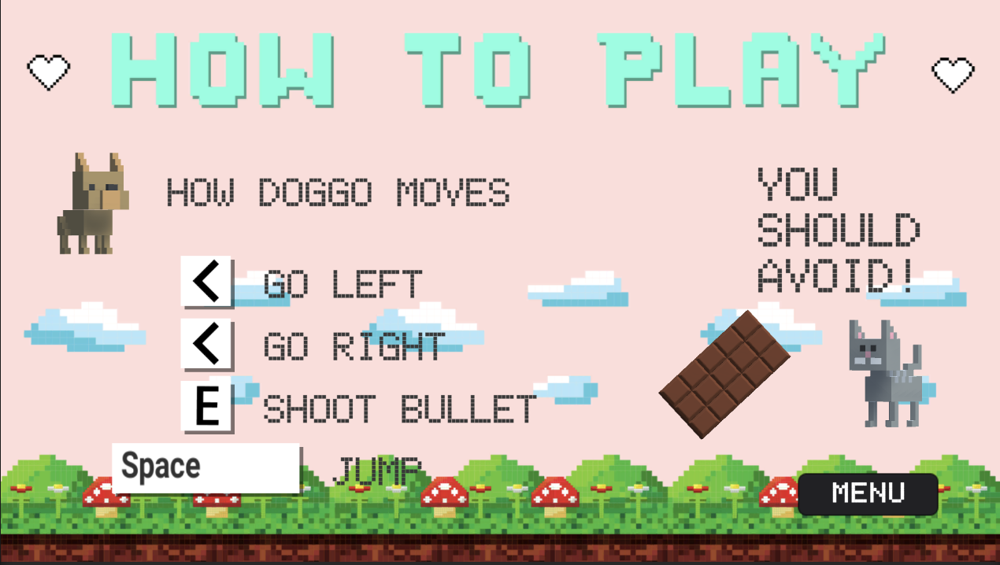
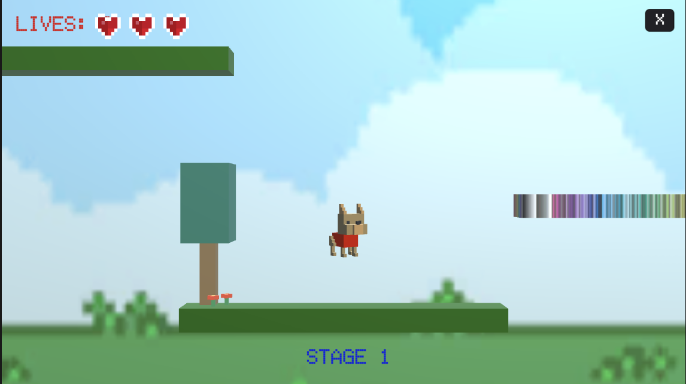
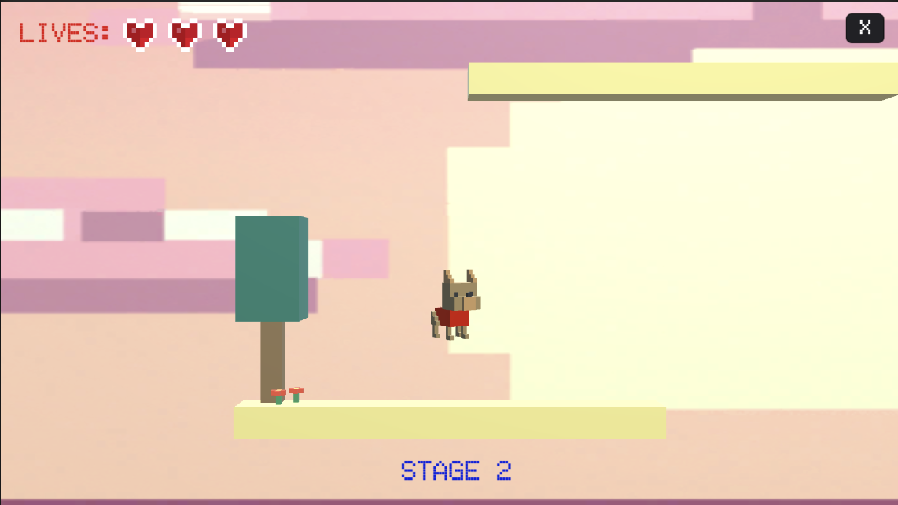
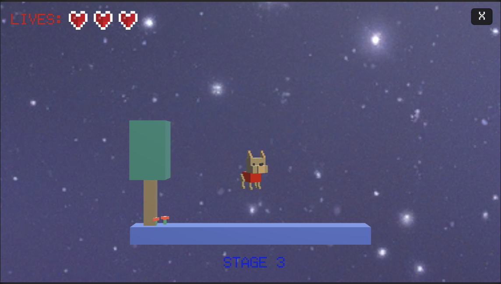
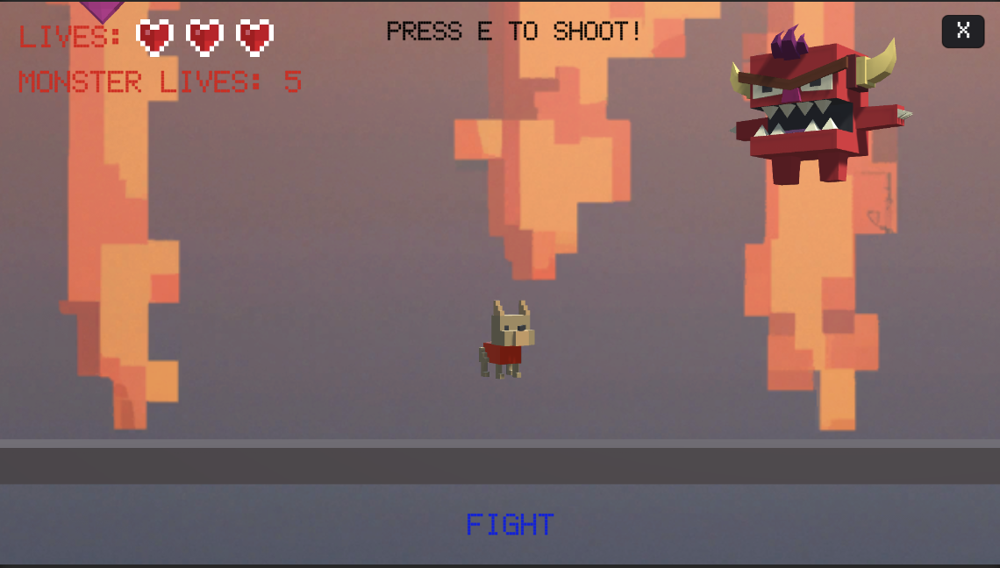

  

A project for the course "Introduction to Unity" in SS2022 in Osnabrück University.

Submitted by: 
- Raia Abu Ahmad
- Eunhye Yun
- Manar Ali

Bone Appetit is a 2.5D game. The game consists of 4 stages varying in difficulty. Our main character to be controlled is a dog called Doggo.

  

## The Story
Doggo has been trapped by a monster in an imaginary world. In the beginning, everything looks nice and attractive for Doggo. However, suddenly the sky starts raining chocolates which is deadly for him. In addition, his worst enemies, the Cattos are there, and only touching them makes him lose one of his lives. 
In order to escape this nightmare and go back to reality, Doggo has to find a bone in each stage. The bone works as a portal, which teleports Doggo to higher stages. Finally in stage 4 Doggo faces his capturer, the monster, where he can shoot him with love. If Doggo shoots enough heart bullets on the monster, the monster goes away and Doggo wins and goes back to reality.

  

## Scenes

### Main Page and Controls
We start our game with the main page, which we created on [Canva](https://www.canva.com/en_gb/). After pressing the <kbd>LET'S  START</kbd> button on the main page, the game starts with the first stage.
Optionally you can press the  <kbd>CONTROLS</kbd> button to show the game instructions. We also added an <kbd>EXIT</kbd>button to exit the game. We have a different background for each stage, where all backgrounds were created by [DALL.E](https://openai.com/blog/dall-e/). We got the music for free from [bensound](https://www.bensound.com/free-music-for-videos). On the left top of the screen you can see how many lives Doggo have, indicated by the heart asset number.

  

  

#### Stage 1
In the first level, we have different platforms on which Doggo can move around. 
Doggo can explore the environment by:
- Moving left and right by pressing <kbd><-</kbd> and <kbd>-></kbd> keys
- Jumping by pressing the <kbd>SPACE</kbd> key

As the game progresses, chocolate bars start falling from the sky, which our poisonous for Doggo, so if he touches them he loses a life.

We also placed heart units, where Doggo can compensate for one lost life. Doggo has a maximum of 3 lives. When Doggo toches the bone he can teleport to stage 2.
  
  

  

  
#### Stage 2
The second level is more complicated than the first level. We have added a new enemy "Catto". If Doggo toches Catto he loses on of his lives.
  
  

  

  
#### Stage 3
We made the third level more complicated than the other levels by adding more platforms and Cattos.
  
  

  

  
#### Stage 4 (the final fight)
In the final level, Doggo has to fight the monster where he can shoot him with heart bullets by pressing the <kbd>E</kbd> button. The monster has a total of 5 lives and can shoot fire at Doggo. If Doggo shoots enought heart bullets on the monster, Doggo wins!
  
   

  

  

### Demo
The demo video could be found [here](https://www.youtube.com/watch?v=HCgkZ9lhsUE).
  
### Assets
We got all assets for free from the Asset Store, except for the chocolate bar, which we made on [blender](https://www.blender.org/)
  
  

  

  
### Download links
  - [Windows version](https://drive.google.com/drive/folders/1WwhcHsHj-cTA_PGmGA5q4hrlkfv2HRpH?usp=sharing): 
  - [Mac version](https://drive.google.com/drive/folders/1OS_66ZSZxR_VoIsPoB1Iq5Sts6zagfEj?usp=sharing)
  
